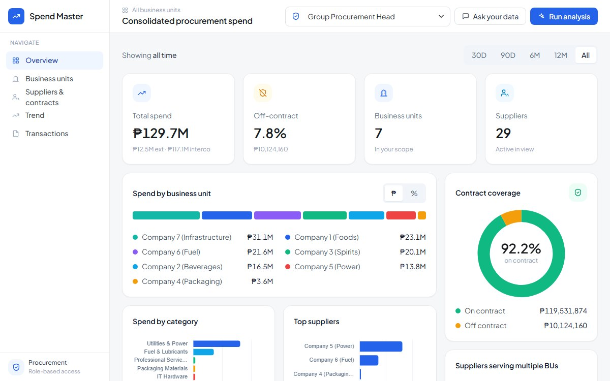

# Spend Master

A procurement spend analytics prototype for a diversified group: one place for group and business-unit procurement heads to see where money goes, what is off contract, and which suppliers they share.

**Live:** https://spend-master-demo.netlify.app



> All data is generated in the browser. Company, supplier, and business unit names are placeholders ("Company 1 (Foods)", "IT Vendor 1"), not real organizations.

## The problem

In a group with several business units, each unit buys on its own. Group procurement cannot easily answer the questions that save money:

- How much is spent off contract, and with whom?
- Which suppliers already serve several business units, so the group could negotiate once?
- Where does the same item cost very different amounts?
- How much of the "spend" is really one group company buying from another?

## Who it's for

| Role | Sees |
| --- | --- |
| Group Procurement Head | Every business unit |
| Business unit head (Foods, Fuel, Power) | Their own unit only |
| Category Manager, IT and Technology | IT hardware, office supplies, and professional services across all units |

Switching role changes every number on the page, because each role only ever gets the rows it is allowed to see.

## What it does

- **Dashboard:** total and off-contract spend, spend by business unit and category, top suppliers, contract coverage, suppliers serving several units, and contracts nearing expiry, over 30 days to all time.
- **Run analysis:** a short wizard (time window, focus areas, optional files) that produces written findings on off-contract spend, category concentration, price variance, and cross-unit supplier leverage.
- **Ask your data:** a chat over the same authorized rows, with suggested follow-up questions and an optional web mode for outside context.
- **Report builder:** collect findings and charts into an editable report, run an AI review for clarity and tone, and export it as a PDF.

## Key decisions

- **Scope the data before anything else.** Role scoping runs first, so the dashboard, the analysis, and the AI all work from the same authorized rows. There is no way for a business unit head to see another unit's spend, even through the chat.
- **Separate intercompany spend.** Purchases from other group companies are flagged, so group totals and supplier leverage are not overstated.
- **AI is optional.** Without an AI proxy, findings are computed directly from the data. With one, the model only receives aggregated figures, a 25-row sample, and the contract list, never the full dataset.
- **One file, no build.** The prototype is a single HTML page so stakeholders can open it anywhere and it can be hosted as a static file.

## Architecture


## Running it

Open `index.html` in a browser, or serve the folder with any static server:

```bash
npx serve .
```

To enable AI findings, host the page behind a proxy that answers `POST /api/complete` in the Anthropic Messages response format. The proxy is not part of this repository.

## Tech

HTML, CSS, and vanilla JavaScript in one file, with Bootstrap 5 for layout and Chart.js for charts.

## What I'd do next

- Load a real spend extract (CSV) instead of generated data, with the same role scoping applied on upload
- Let category managers set target prices so variance is measured against a benchmark
- Save reports so a finding can be tracked until it is resolved

Built by [Joseph Villanueva](https://joseph-villanueva-portfolio.vercel.app).
